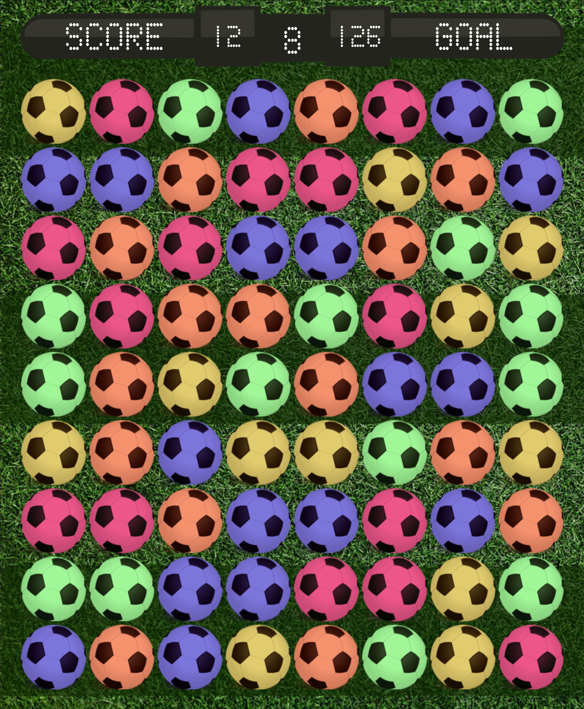

# soccercrush

Soccercrush is a project I developed in my first semester at UFMG. It's a basic candy crush game with a soccer theme.

## Dependencies
- C
- Allegro

## Compiling
From the root directory type:

```bash
make candy
```

## Run
From the root directory type:
```bash
./candy
```
## Have fun

